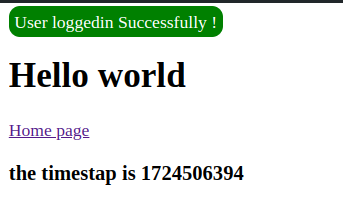
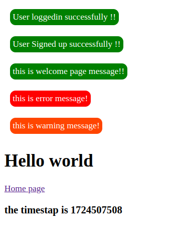
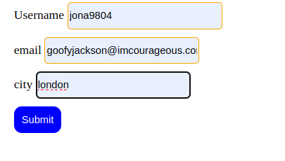

# 1. Routes
## route/web.php

```
Route::get('/home', function() {
    return view('home);
});
```

```
Route::view('/home', 'home');
```

> localhost:8000/post/krishna/23
```
Route::get('/post/{name}/{age}', function($name, $age) {
    return view('post', ["name"=>$name, "age"=> age]);
});
```

```
Route::redirect('/home', '/post');
```
---

# 2. Controllers

> app/Http/Controllers/

> php artisan make:controller UserController

* ## Inside UserController Class
```
function getUser(){
    return 'Krishna Mandal';
}
function aboutUser(){
    return 'Krishna Mandal, 23';
}
function getUserName($name, $age){
    return 'Hello, ' . $name . $age;
}
function getViewPage(){
    return view('view'); //view.blade.php
}

```
* ## web.php
```
Route::get('user', [UserController::class, 'getUser']);

Route::get('about-user', [UserController::class, 'aboutUser']);

Route::get('get-user-name/{name}/{age}', [UserController::class, 'getUserName']);

Route::get('view', [UserController::class, 'getViewPage']);

```
---

# 3. Views

> php artisan make:view about

```
Route::get('admin-login/{abc}', [UserController::class, 'adminLogin']);
```

```
function adminLogin($name){
        // checks if view exists or not
        if (View::exists('admin.login')) {
            return view('admin.login', ["abc" => $name]);
        } else {
            return "No view found !";
        }
}
```

```
<h1>Admin page</h1>
{{ $abc }}
```
---

# 4. Blade Template
* ## @if .. @else
```
<h1>First template</h1>
{{ $xyz_address }}

@if ($xyz_address == 'biratnagar')
    Yes
@else
    No
@endif
```

* ## @for .. @endfor
```
<select id="year" name="year" class="form-control ">
    {{ $last = date('Y') - 120 }}
    {{ $now = date('Y') }}

    @for ($i = $now; $i >= $last; $i--)
        <option value="{{ $i }}">{{ $i }}</option>
    @endfor
</select>
```

* ## @foreach .. @endforeach
```
{{-- random number --}}
<p>{{ rand() }}</p>

{{ $arr1[0] }}

@for ($i = 0; $i < 10; $i++)
    {{ $i }}
@endfor

@foreach ($arr1 as $item)
    <div>
        {{ $item }}
    </div>
@endforeach
```

---

# Componenets
> php artisan make:component messageBanner

* ## message-banner.blade.php
```
<div>
    <span>User loggedin Successfully !</span>
</div>
```

* ## welcome.blade.php
```
{{-- Calling the message-banner component --}}
<x-message-banner />
```

* ## views/components/message-banner.blade.php
```
<style>
    .warning {
        background-color: orangered;
        color: #fff;
        padding: 5px;
        border-radius: 10px;
        margin: 10px;
        display: inline-block;
    }
</style>

<div>
    <span class="{{ $class }}">{{ $msg }}!</span>
</div>
```

* ## app/Http/View/Components/messageBanner.php
```
public $msg;
public $class;

public function __construct($msg, $class)
{
    $this->msg = $msg;
    $this->class = $class;
}
```
* ## welcome.blade.php
```
<x-message-banner msg="User loggedin successfully !" class="success" />
<x-message-banner msg="User Signed up successfully !" class="success" />
<x-message-banner msg="this is welcome page message!" class="success" />
<x-message-banner msg="this is error message" class="error" />
<x-message-banner msg="this is warning message" class="warning" />
```


---

# Input fields/form
> php artisan make:view user-form
> php artisan make:controller FormController

* ## user-form.blade.php
```
<form action="addUser" method="post">
    @csrf
    <div class="input-wrapper">
        <label for="">Username</label>
        <input type="text" placeholder="username" name="username">
    </div>
    <div class="input-wrapper">
        <label for="">email</label>
        <input type="email" placeholder="email" name="email">
    </div>
    <div class="input-wrapper">
        <label for="">city</label>
        <input type="text" placeholder="city" name="city">
    </div>
    <div class="input-wrapper">
        <button type="submit">Submit</button>
    </div>
</form>
```
* ## FormController.php
```
function addUserForm(Request $request)
{
    // return $request;
    echo $request->username . "<br/>";
    echo $request->email . "<br/>";
    echo $request->city . "<br/>";
}
```
* ## web.php
```
// Form/User-Input

// 'fileName', 'routeName'
Route::view('user-form', 'user-form');

// routeName, [ControllerName::class, 'functionNameInsideController']
Route::post('addUser', [FormController::class, 'addUserForm']);
```



---