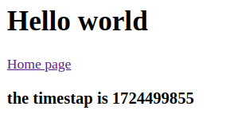

# 1. Routes
## route/web.php

```
Route::get('/home', function() {
    return view('home);
});
```

```
Route::view('/home', 'home');
```

> localhost:8000/post/krishna/23
```
Route::get('/post/{name}/{age}', function($name, $age) {
    return view('post', ["name"=>$name, "age"=> age]);
});
```

```
Route::redirect('/home', '/post');
```
---

# 2. Controllers

> app/Http/Controllers/

> php artisan make:controller UserController

* ## Inside UserController Class
```
function getUser(){
    return 'Krishna Mandal';
}
function aboutUser(){
    return 'Krishna Mandal, 23';
}
function getUserName($name, $age){
    return 'Hello, ' . $name . $age;
}
function getViewPage(){
    return view('view'); //view.blade.php
}

```
* ## web.php
```
Route::get('user', [UserController::class, 'getUser']);

Route::get('about-user', [UserController::class, 'aboutUser']);

Route::get('get-user-name/{name}/{age}', [UserController::class, 'getUserName']);

Route::get('view', [UserController::class, 'getViewPage']);

```
---

# 3. Views

> php artisan make:view about

```
Route::get('admin-login/{abc}', [UserController::class, 'adminLogin']);
```

```
function adminLogin($name){
        // checks if view exists or not
        if (View::exists('admin.login')) {
            return view('admin.login', ["abc" => $name]);
        } else {
            return "No view found !";
        }
}
```

```
<h1>Admin page</h1>
{{ $abc }}
```
---

# 4. Blade Template
* ## @if .. @else
```
<h1>First template</h1>
{{ $xyz_address }}

@if ($xyz_address == 'biratnagar')
    Yes
@else
    No
@endif
```

* ## @for .. @endfor
```
<select id="year" name="year" class="form-control ">
    {{ $last = date('Y') - 120 }}
    {{ $now = date('Y') }}

    @for ($i = $now; $i >= $last; $i--)
        <option value="{{ $i }}">{{ $i }}</option>
    @endfor
</select>
```

* ## @foreach .. @endforeach
```
{{-- random number --}}
<p>{{ rand() }}</p>

{{ $arr1[0] }}

@for ($i = 0; $i < 10; $i++)
    {{ $i }}
@endfor

@foreach ($arr1 as $item)
    <div>
        {{ $item }}
    </div>
@endforeach
```

---